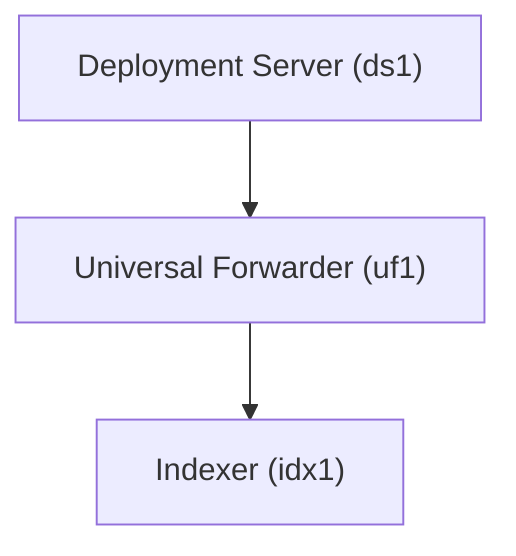

# Splunk Deployment Server & Universal Forwarder Lab (Docker)

## Overview

This repository provides a **Docker-based Splunk environment** designed to simulate how a **Deployment Server (DS)** manages **Universal Forwarders (UF)** and forwards data to an Indexer.

The lab demonstrates the following Splunk architectures:

- **Deployment Server (DS) Management**
- **Universal Forwarder (UF) Configuration**
- **App Deployment via Server Classes**
- **Data Forwarding to Indexer**

In this lab:

- The **Indexer is already configured** in both deployment modes.
- The **Deployment Server manages Universal Forwarders**.
- The **Universal Forwarder sends data to the Indexer**.
- The **difference between the two deployment modes only affects the Deployment Server and UF configuration**.

This environment allows you to practice:

- Configuring a Deployment Server
- Creating and managing server classes
- Deploying apps to Universal Forwarders
- Registering forwarders to a Deployment Server
- Forwarding data to an indexer
- Monitoring forwarder activity in Splunk

---

## Architecture



---

| Component           | Hostname | Web Port | Management Port | Indexing Port |
|--------------------|----------|----------|----------------|---------------|
| Deployment Server  | ds1      | 8000     | 8089           | N/A           |
| Universal Forwarder| uf1      | N/A      | 8089           | N/A           |
| Indexer            | idx1     | 8000     | 8089           | 9997          |

All containers run on the external Docker network:

```
skynet
```

---

## Prerequisites

### 1 Install Docker

Install Docker and Docker Compose.

```
https://docs.docker.com/get-docker/
```

---

### 2 Create Docker Network

Create the external network used by the lab.

```
docker network create skynet
```

---

### 3 Create `.env` File

Create a `.env` file in the project root.

Example:

```
SPLUNK_PASSWORD=YourStrongPassword
```

---

## Deployment Modes

### 1 Base Environment (Manual Configuration)

This deployment starts all Splunk components, but the **Deployment Server and Universal Forwarder are not configured**.

The **Indexer is already configured**, but no deployment or forwarding is set.

Components started:

- Deployment Server (ds1)
- Universal Forwarder (uf1)
- Indexer (idx1)

Allows you to manually practice:

- Configuring the Deployment Server
- Creating apps in `deployment-apps`
- Defining server classes
- Registering the Universal Forwarder to the Deployment Server
- Configuring forwarding (`outputs.conf`)
- Testing data ingestion into the indexer

Start environment:

```
docker-compose -f docker-compose.manual.yml up -d
```

---

### 2 Preconfigured Deployment Environment

This deployment automatically configures the environment during container startup:

- Deployment Server (ds1) is configured and serving apps
- Universal Forwarder (uf1) is registered to the Deployment Server
- Universal Forwarder is configured to forward data to idx1

Start environment:

```
docker-compose -f docker-compose.preconfigured.yml up -d
```

The environment is fully configured and will automatically:

- Deploy apps from the Deployment Server to the Universal Forwarder
- Apply configurations via server classes
- Forward data to the indexer
- Allow validation of deployment and forwarding behavior

---

## Repository Structure

```
.
├── .env
├── docker-compose.manual.yml
├── docker-compose.preconfigured.yml
├── README.md
├── ds1_apps_data/
│   ├── test_apps
├── docs/
│   ├── deployment-guide.md
│   ├── post-deployment-validation.md
```
