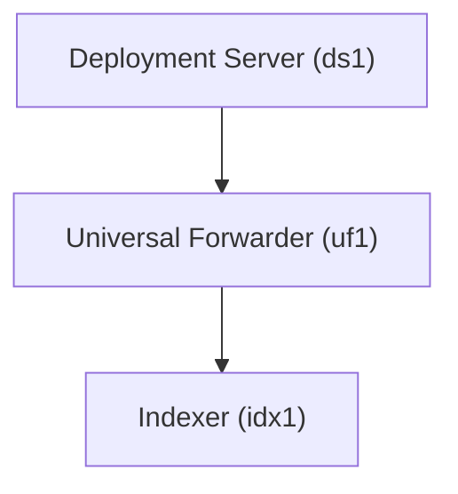

# Splunk Deployment Server & Universal Forwarder Lab (Docker)

## Overview

This repository provides a Docker-based Splunk environment designed to simulate how a **Deployment Server (DS)** manages **Universal Forwarders (UF)** and connects them to an Indexer.

The lab contains:

- **1 Deployment Server (ds1)**
- **1 Universal Forwarder (uf1)**
- **1 Indexer (idx1)**

This environment allows you to practice:

- Configuring a Deployment Server
- Deploying apps to Universal Forwarders
- Connecting Universal Forwarders to Indexers
- Monitoring forwarder activity in Splunk

---

## Architecture



| Component          | Hostname | Web Port | Management Port | Indexing Port |
|-------------------|----------|----------|----------------|---------------|
| Deployment Server  | ds1      | 8000     | 8089           | N/A           |
| Universal Forwarder| uf1      | N/A      | 8089           | N/A           |
| Indexer            | idx1     | 8000     | 8089           | 9997          |

---
All containers run on the external Docker network:

```
skynet
```

---

## Prerequisites

### 1 Install Docker

Install Docker and Docker Compose.

```
https://docs.docker.com/get-docker/
```

---

### 2 Create Docker Network

Create the external network used by the lab.

```
docker network create skynet
```

---

### 3 Create `.env` File

Create a `.env` file in the project root.

Example:

```
SPLUNK_PASSWORD=YourStrongPassword
SPLUNK_SHC_SECRET=SHClusterSecret123
```

---

## Deployment Modes

### 1 Base Environment

This deployment starts the following components:

- 1 Indexer (idx1) – already configured and ready to receive data  
- 1 Deployment Server (ds1) – running but **not yet configured**  
- 1 Universal Forwarder (uf1) – running but **not yet configured or enabled**  

This mode allows you to manually practice:

- Configuring the Deployment Server  
- Setting up apps and server classes  
- Registering the Universal Forwarder with the Deployment Server  
- Forwarding data from the Universal Forwarder to the Indexer  

This setup is useful for learning manual deployment server and UF configuration.

---

### 2 Preconfigured Deployment Environment

This deployment automatically configures the Universal Forwarder to communicate with the Deployment Server and forward data to the Indexer during container startup.  

The configuration includes:

- Deployment Server automatically serving apps from `deployment-apps`  
- Universal Forwarder automatically registered to the Deployment Server  
- Indexer ready to receive forwarded data from UF  

This mode is useful for:

- automated lab environments  
- repeatable testing  
- learning deployment server and UF architecture  
